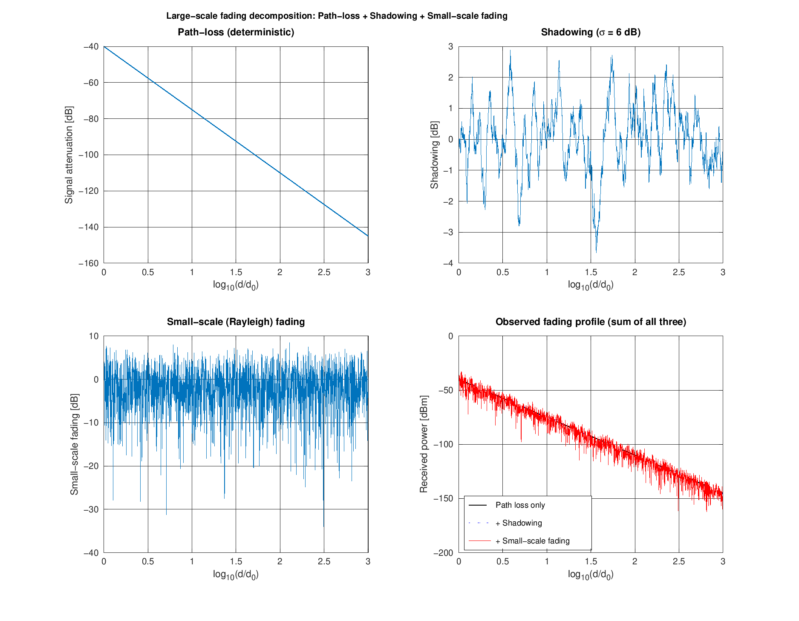

# 2. Large-Scale Fading

Large-scale fading models characterize **average** signal strength as a
function of Tx-Rx separation distance -- i.e. what happens as you average
out variations that occur over distances of the order of one wavelength
(that averaging is what separates "large-scale" from "small-scale"
fading, see [03_small_scale_fading.md](03_small_scale_fading.md)).

It is the combination of two effects:

```
P_Rx[dBm] = P_Tx[dBm] + A_PL[dB] + A_S[dB] + A_SS[dB]
                          \___________/  \____/
                          large-scale    small-scale
                          (this file)    (next file)
```

## 2.1 Path loss (deterministic)

### Free-space (Friis) model

Electromagnetic waves spread out spherically from the transmitter. The
fraction of power captured by a receive antenna of effective area `A` at
distance `d` is:

```
Pr = Pt * A / (4*pi*d^2),      A = (1/pi)*(lambda/2)^2
```

**Worked example (from the slide, `fc = 3 GHz`, `lambda = 0.1 m`):**
- At `d = 1 m`:  only 0.006% of transmit power is received (**-42 dB**)
- At `d = 10 m`: only 0.00006% is received (**-62 dB**)

This is implemented in
[`src/path_loss/free_space_path_loss.m`](../src/path_loss/free_space_path_loss.m)
and validated against these exact numbers in
[`tests/run_all_tests.m`](../tests/run_all_tests.m).

### Log-distance model (general environments)

Free space (path-loss exponent `n = 2`) is the best case. Real
environments attenuate faster:

```
PL(d) = PL(d0) + 10*n*log10(d/d0)
```

| Environment                      | Path-loss exponent `n` |
|-----------------------------------|--------------------------|
| Free space                        | 2                        |
| Urban area cellular radio         | 2.7 - 3.5                |
| Urban area cellular (obstructed)  | 3 - 5                    |
| In-building, line-of-sight        | 1.6 - 1.8                |
| Obstructed in-building            | 4 - 6                    |
| Obstructed in factories           | 2 - 3                    |

Implemented in
[`src/path_loss/log_distance_path_loss.m`](../src/path_loss/log_distance_path_loss.m).

### Frequency dependence

For `fc < 6 GHz`, attenuation grows with the **square** of frequency
(doubling frequency roughly quadruples free-space loss, i.e. +6 dB).
Beyond that, oxygen and water-vapor absorption add sharp attenuation
peaks (e.g. ~60 GHz oxygen absorption line) -- this is why mmWave
cellular systems need much denser cell deployments (see the
"Path-loss and cell size" trade-off: coverage cells use low frequencies,
capacity/mmWave cells must be small).

## 2.2 Shadowing (random)

Two points at the *same* distance from the transmitter can still see
very different average attenuation, because of different local
obstacles (a building in the way vs. an open field). This is modeled as
a **zero-mean, log-normal** random variable (Gaussian in the dB domain):

```
A_S ~ N(0, sigma^2),   typical sigma = 0-9 dB
p(A_S) = 1/sqrt(2*pi*sigma^2) * exp(-A_S^2 / (2*sigma^2))
```

Implemented in
[`src/shadowing/lognormal_shadowing.m`](../src/shadowing/lognormal_shadowing.m).

## 2.3 Putting it together

[`scripts/run_large_scale_fading_demo.m`](../scripts/run_large_scale_fading_demo.m)
reproduces the slide's 3-component decomposition figure: it generates a
deterministic path-loss curve (n=3.5, urban), adds smoothed log-normal
shadowing (sigma=6 dB), adds fast Rayleigh small-scale fading (see next
doc), and plots all three individually plus their sum -- the "observed
fading profile."



The script also verifies the path-loss slope numerically: with `n=3.5`,
going from 1 m to 1000 m (3 decades) should add exactly `10*3.5*3 = 105
dB` of attenuation -- the script confirms this to machine precision.
