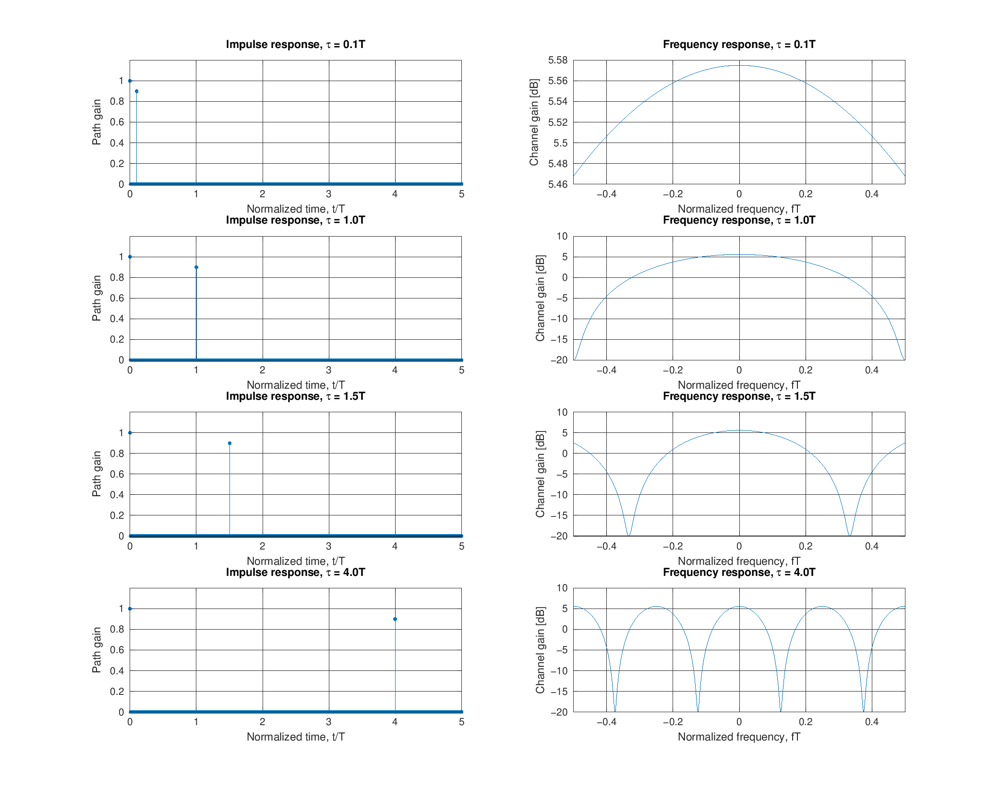

# 3. Small-Scale Fading

Small-scale fading captures the **fast** fluctuations of instantaneous
received power over distances of the order of a wavelength -- the result
of many delayed, phase-shifted replicas of the transmitted signal
arriving at the receiver and interfering (constructively or
destructively).

## 3.1 The multipath channel model

Neglecting noise, the channel is an LTI filter whose impulse response is
a sum of delayed, weighted, phase-shifted deltas:

```
h(t) = sum_{l=0}^{L-1} alpha_l * exp(j*phi_l) * delta(t - tau_l)
```

- `alpha_l` (path gain) is modeled as **Rayleigh-distributed**
- `phi_l` (path phase) is modeled as **uniform on [0, 2*pi]**

### Rayleigh distribution

With the normalization `E{alpha^2} = 1` used throughout this project:

```
p(alpha) = 2*alpha*exp(-alpha^2),  alpha >= 0
```

Implemented in [`src/fading/rayleigh_pdf.m`](../src/fading/rayleigh_pdf.m)
and [`src/fading/rayleigh_fading_gen.m`](../src/fading/rayleigh_fading_gen.m)
(generated as `|hI + j*hQ|` with `hI, hQ ~ N(0, 1/2)` -- the standard way
to produce a Rayleigh amplitude from an underlying complex Gaussian
channel).

## 3.2 Delay spread: quantifying time dispersion

Given a set of path gains and delays, the **mean excess delay** and
**RMS delay spread** are computed by treating the normalized path powers
`p_l = alpha_l^2 / sum(alpha_l^2)` as an empirical probability mass:

```
tau_bar = sum(p_l * tau_l)
tau_rms = sqrt( sum(p_l * tau_l^2) - tau_bar^2 )
```

Implemented in [`src/multipath/delay_spread.m`](../src/multipath/delay_spread.m).

### Worked example: the two-ray channel `h(t) = delta(t) + 0.9*delta(t-tau)`

[`scripts/run_two_ray_model_demo.m`](../scripts/run_two_ray_model_demo.m)
reproduces the slide's four worked cases (`tau = 0.1T, T, 1.5T, 4T`),
plotting both the impulse response and the resulting frequency response
`|H(f)|`:



Notice how the frequency response develops **deeper and more frequent
notches** as `tau` grows relative to `T` -- this is the essence of
frequency-selective fading.

> **A note on validating against the source material:** while
> cross-checking these numbers, `tests/run_all_tests.m` found that the
> slide's own printed value of `tau_rms ~= 2.3T` for the `tau = 4T` case
> is inconsistent with its own intermediate numbers (`tau_bar = 1.8T`,
> `tau_bar^2_mean = 7.2T^2` imply `tau_rms = sqrt(7.2 - 1.8^2) ~= 1.99T`,
> not `2.3T`). The code and tests use the mathematically-derived value.
> This kind of cross-check is exactly the point of building an
> executable version of a slide deck instead of trusting it at face
> value.

## 3.3 Coherence bandwidth

The delay spread determines how "wide" a frequency band can be before
the channel response is no longer approximately flat:

```
Bc ~= 1 / (5*sigma_tau)
```

Implemented in
[`src/multipath/coherence_bandwidth.m`](../src/multipath/coherence_bandwidth.m).

| Condition                | Regime                                    |
|---------------------------|--------------------------------------------|
| `sigma_tau << T` (`Bc > Bs`) | **Flat fading** -- one resolvable path      |
| `sigma_tau > T` (`Bc < Bs`)  | **Frequency-selective / multipath fading** -- ISI |

Typical measured RMS delay spreads (and derived coherence bandwidths):

| Environment      | `sigma_tau` | `Bc`      |
|------------------|-------------|-----------|
| Urban (NYC)      | 1300 ns     | 150 kHz   |
| LTE ETU          | up to 5 us  | >= 40 kHz |
| Suburban (extreme)| 2000 ns    | 100 kHz   |
| Indoor office    | 10-100 ns   | 2-20 MHz  |

## 3.4 Where this feeds into the rest of the project

- The frequency-selective channel from this section is what causes the
  **irreducible BER floor** demonstrated in
  [05_ber_analysis.md](05_ber_analysis.md) and
  [`scripts/run_isi_ber_demo.m`](../scripts/run_isi_ber_demo.m).
- Combined with the Doppler analysis in
  [04_doppler_time_varying.md](04_doppler_time_varying.md), it produces
  the full flat/frequency-selective x slow/fast classification used in
  [`scripts/run_full_channel_simulation.m`](../scripts/run_full_channel_simulation.m).
