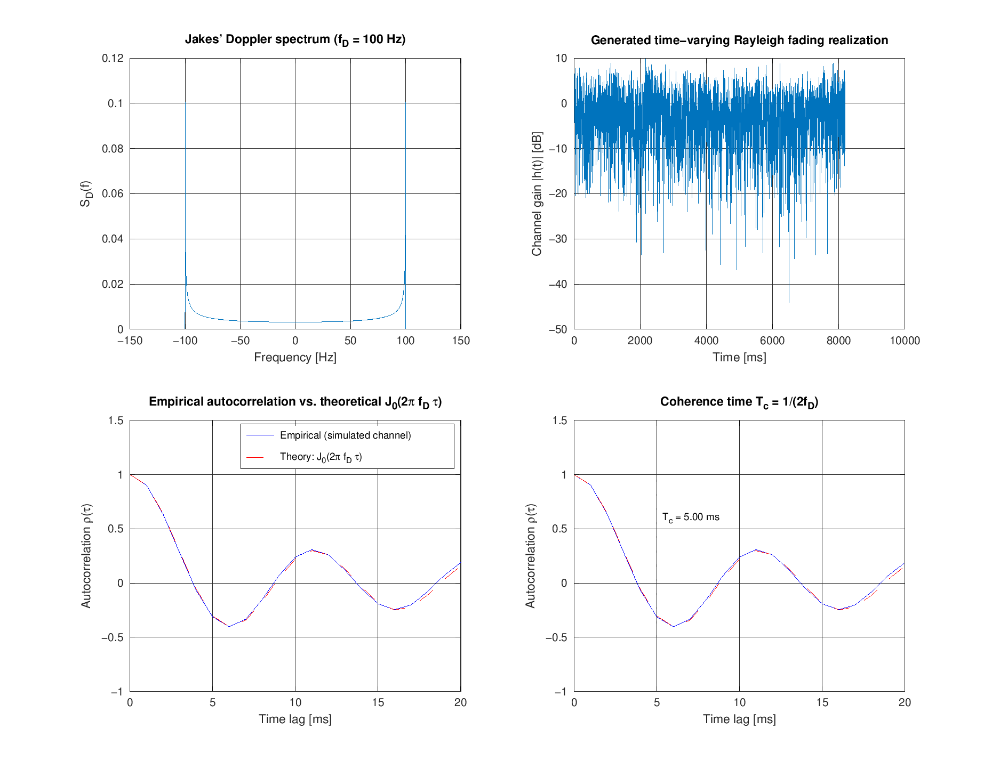
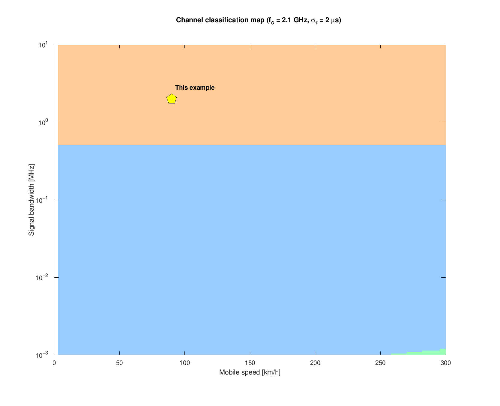

# 4. Time-Varying Channel: Doppler Effect

If the receiver (or transmitter, or surrounding scatterers) is moving,
the channel's path gains and phases change over time -- the channel
itself becomes a function of two variables, `h(tau, t)`.

## 4.1 Doppler shift

For a receiver moving at constant velocity `v` relative to a single-path
source at carrier frequency `fc`:

```
fD = -fc*v/c = -v/lambda
```

- Moving away (`v > 0`): `fD < 0` (received frequency drops)
- Moving towards (`v < 0`): `fD > 0` (received frequency rises)

Implemented (magnitude only, since most downstream quantities only
depend on `|fD|`) in
[`src/doppler/doppler_shift.m`](../src/doppler/doppler_shift.m).

## 4.2 Doppler spread and the Jakes spectrum

In a *multipath* channel, replicas arrive from many different angles, so
instead of a single shift you get a **Doppler spread** -- the received
signal's spectrum is broadened rather than simply shifted. Assuming
uniform (isotropic) scattering, this broadening follows the classical
**Jakes' Doppler spectrum**:

```
S_D(f) = 1 / (pi*fD*sqrt(1 - (f/fD)^2)),   |f| < fD
```

Implemented in
[`src/doppler/jakes_doppler_spectrum.m`](../src/doppler/jakes_doppler_spectrum.m).

In the time domain, the channel's autocorrelation is the **0th-order
Bessel function of the first kind**:

```
rho(t) = J0(2*pi*fD*t)     <=>     S_D(f)   (Fourier transform pair)
```

## 4.3 Generating a realistic time-varying fading channel

[`src/doppler/jakes_fading_timeseries.m`](../src/doppler/jakes_fading_timeseries.m)
implements the classical **filtered white-noise method**: shape a
complex white Gaussian noise sequence in the frequency domain by
`sqrt(S_D(f))`, then inverse-FFT back to the time domain. This produces
a Rayleigh-distributed, time-correlated fading process with exactly the
Doppler spread you specify.

[`scripts/run_doppler_spectrum_demo.m`](../scripts/run_doppler_spectrum_demo.m)
generates such a process and **empirically verifies** that its
autocorrelation matches the theoretical `J0(2*pi*fD*t)` curve:



(RMSE between simulated and theoretical autocorrelation: ~0.017 -- a
strong numerical confirmation of the classical Jakes model.)

## 4.4 Coherence time

Since `J0(2*pi*x)` first crosses zero near `x = 1/2`, the channel is
considered "uncorrelated" (i.e. has changed appreciably) after:

```
Tc = 1 / (2*fD)
```

Implemented in
[`src/doppler/coherence_time.m`](../src/doppler/coherence_time.m).

| Condition        | Regime                                              |
|-------------------|------------------------------------------------------|
| `Tc > T` (symbol period) | **Slow fading** -- channel ~constant per symbol |
| `Tc < T`                 | **Fast fading** -- channel varies within a symbol, causing synchronization/BER problems |

## 4.5 Worked example (validated against the slide)

For `fc = 2.1 GHz`, `v = 90 km/h` (`25 m/s`):

```
fD = v/lambda = v*fc/c = 175.0 Hz     (slide: 175 Hz  ✓)
Tc = 1/(2*fD) = 2.857 ms              (slide: "~3 ms" ✓)
```

This exact example is reproduced end-to-end (combined with the
coherence-bandwidth analysis from
[03_small_scale_fading.md](03_small_scale_fading.md)) in
[`scripts/run_full_channel_simulation.m`](../scripts/run_full_channel_simulation.m),
which also sweeps speed and bandwidth to produce a 2D
slow/fast x flat/frequency-selective classification map:


