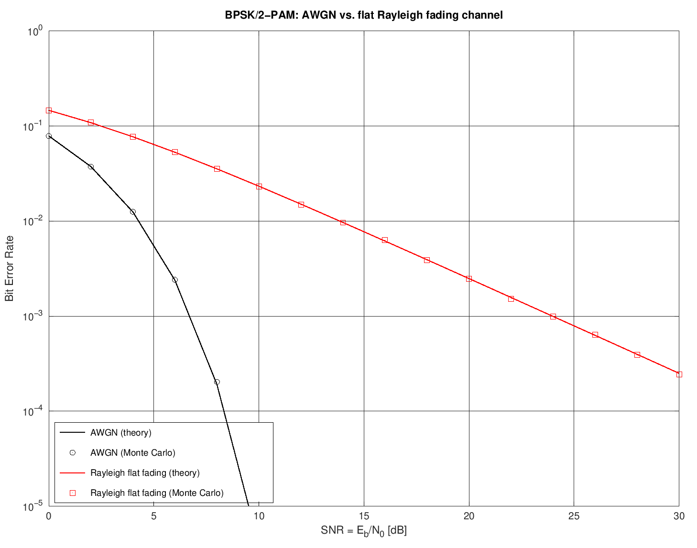
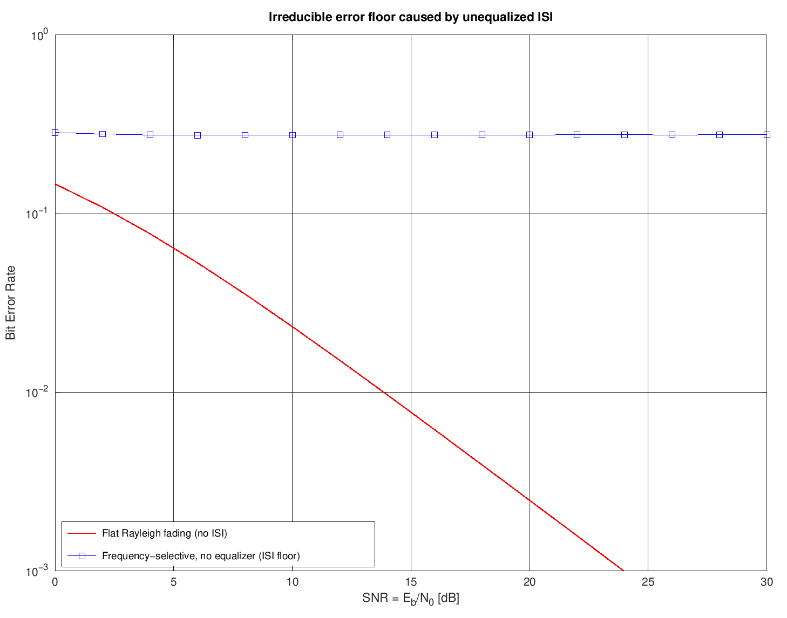

# 5. BER Analysis: Why Fading Matters

This section ties the whole project together by showing the *practical
consequence* of everything above: how much fading actually costs you in
bit-error rate, using 2-PAM/BPSK as the example modulation.

## 5.1 AWGN channel (no fading, baseline)

Decision variable: `x(m) = c_m + n(m)`. The bit-error probability is the
classic Q-function result:

```
Pe = Q(sqrt(2*SNR)) = 0.5*erfc(sqrt(SNR))
```

Implemented in [`src/ber/ber_awgn_2pam.m`](../src/ber/ber_awgn_2pam.m).
This decays **exponentially** with SNR.

## 5.2 Flat Rayleigh fading channel

Decision variable: `x(m) = alpha*c_m + n(m)`, with `alpha` Rayleigh
distributed. Averaging the AWGN conditional error probability over the
Rayleigh pdf gives a closed form:

```
Pe = Integral_0^inf Q(alpha*sqrt(2*SNR)) * p(alpha) d(alpha)
   = 0.5 * ( 1 - sqrt(SNR_bar / (1 + SNR_bar)) )
```

Implemented in
[`src/ber/ber_rayleigh_flat.m`](../src/ber/ber_rayleigh_flat.m). For
large `SNR_bar`, this simplifies to the well-known **1/SNR floor**:

```
Pe ~= 1 / (4*SNR_bar)
```

This is the single most important qualitative result in the whole deck:
**fading turns an exponential BER decay into a much slower ~1/SNR decay.**
You pay a *huge* SNR penalty just from multipath fading, even before
considering inter-symbol interference.

### Validation: Monte Carlo bit-level simulation

[`scripts/run_rayleigh_ber_demo.m`](../scripts/run_rayleigh_ber_demo.m)
doesn't just plot the formulas -- it runs an actual bit-level Monte Carlo
simulation (random bit generation -> BPSK mapping -> channel ->
coherent detection -> error counting) for both channels at 16 SNR points
(2,000,000 bits each), using
[`src/ber/ber_montecarlo_simulate.m`](../src/ber/ber_montecarlo_simulate.m):



The simulated points track the analytical curves essentially exactly,
and the high-SNR `1/(4*SNR)` approximation is confirmed to within 0.1%
error at 30 dB.

## 5.3 Frequency-selective (multipath) channel: the ISI floor

When the delay spread exceeds the symbol period (see
[03_small_scale_fading.md](03_small_scale_fading.md)), replicas of
*different* symbols interfere with each other:

```
x(m) = g(0)*c_m + sum_{k != 0} g(k*T)*c_{m-k} + n(m)
                   \_____________________/
                            ISI
```

If no equalizer is used, this produces an **irreducible error floor**:
BER stops improving no matter how much you increase SNR, because the
dominant error source becomes the (fixed-statistics) interference from
neighboring symbols, not the (SNR-dependent) noise.

[`scripts/run_isi_ber_demo.m`](../scripts/run_isi_ber_demo.m) simulates
exactly this with a two-tap Rayleigh channel (mirroring the slide's
`h(t) = delta(t) + 0.9*delta(t-tau)`, i.e. relative tap powers `[1,
0.81]`), using
[`src/ber/ber_isi_montecarlo.m`](../src/ber/ber_isi_montecarlo.m):



The simulation shows the BER flattening at ~27.6% from as low as 0 dB
all the way to 30 dB, while the flat-fading (no-ISI) curve keeps
improving -- a clean, direct demonstration of why **equalization (or
OFDM, which sidesteps the problem entirely) is essential** in real
wideband wireless systems.

## 5.4 Summary table (matches the slide's "recap" diagram)

| Axis                | Condition                        | Regime                     |
|----------------------|-----------------------------------|-----------------------------|
| Delay domain          | `sigma_tau < T` (`Bc > Bs`)       | Flat fading                 |
|                       | `sigma_tau > T` (`Bc < Bs`)       | Frequency-selective fading  |
| Doppler domain        | `Tc > T` (low Doppler spread)     | Slow fading                 |
|                       | `Tc < T` (high Doppler spread)    | Fast fading                 |

Both axes are computed and classified automatically in
[`scripts/run_full_channel_simulation.m`](../scripts/run_full_channel_simulation.m).
